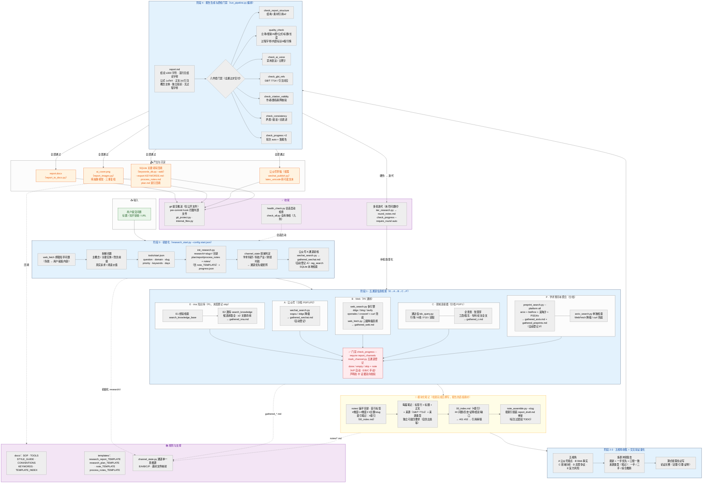
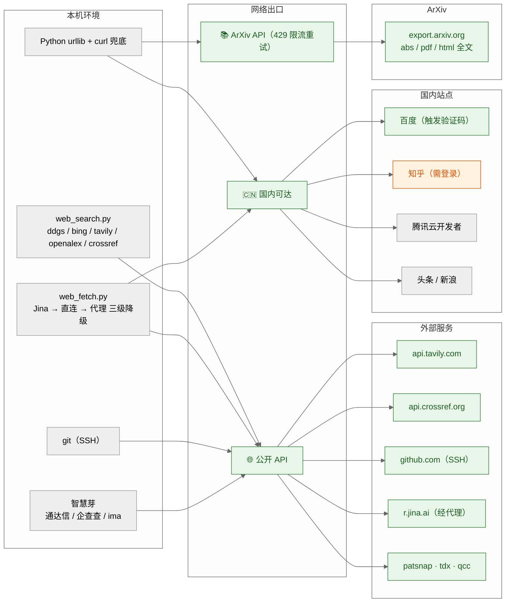

# zhihu-ask 流水线架构图

```mermaid
%%{init: {'theme': 'neutral', 'themeVariables': {'fontFamily': 'Microsoft YaHei, sans-serif'}}}%%
flowchart TB
    subgraph inputs["📥 输入"]
        USER["用户提交问题<br/>标题 / 知乎链接 / URL"]
    end

    subgraph P0["阶段 0 · 初始化（research_start.py --config start.json）"]
        P0a["web_fetch 抓取知乎问题<br/>（失败 → 用户粘贴内容）"]
        P0b["拆解问题<br/>主概念 / 关键实体 / 隐含前提<br/>真实诉求 / 阅读价值"]
        P0c["tools/start.json<br/>question · domain · slug<br/>priority · keywords · days"]
        P0d["init_research.py<br/>research/&lt;slug&gt;/ 目录<br/>plan/report/process_notes + notes/<br/>（含 note_TEMPLATE）+ .progress.json"]
        P0e["channel_state 领域判定<br/>学术科研 / 科技产业 / 财经时政<br/>→ 通道优先级矩阵"]
        P0f["公众号 A 通道初检<br/>wechat_search.py → gathered_wechat.md<br/>（自动登记 A）· rag_search SQLite 本地检索"]
        P0a --> P0b --> P0c --> P0d --> P0e --> P0f
    end

    subgraph P1["阶段 1 · 五通道信息检索（E→A→B→C→P）"]
        direction TB

        subgraph E["E · ima 知识库（P1，未配置记 skip）"]
            E1["E1 经验检索 search_knowledge_base"]
            E2["E2 逐库 search_knowledge<br/>候选库取全 · ≥2 关键词/库<br/>→ gathered_ima.md"]
            E1 --> E2
        end

        subgraph A["A · 公众号（分档 P0/P1/P2）"]
            A1["wechat_search.py<br/>sogou / ddgs 降级<br/>→ gathered_wechat.md（自动登记）"]
        end

        subgraph B["B · Web（P0 通用）"]
            B1["web_search.py 多引擎<br/>ddgs / bing / tavily<br/>openalex / crossref + curl 兜底<br/>web_fetch.py 三级降级直抓<br/>→ gathered_web.md"]
        end

        subgraph C["C · 领域连接器（分档 P0/P1）"]
            C1["通达信 tdx_query.py<br/>行情 / K线 / F10 / 选股"]
            C2["企查查 · 智慧芽<br/>工商/股东 · 专利/论文全文<br/>→ gathered_c.md"]
            C1 --- C2
        end

        subgraph P["P · 学术预印本聚合（分档）"]
            P1a["preprint_search.py --platform all<br/>arxiv + bioRxiv + 浪淘沙 + PSSXiv<br/>→ gathered_arxiv.md + gathered_preprints.md<br/>（自动登记 P）"]
            P1b["arxiv_search.py 单独检索<br/>WebFetch 降级 / curl 兜底"]
            P1a --- P1b
        end

        E --> GATE
        A --> GATE
        B --> GATE
        C --> GATE
        P --> GATE

        GATE["✅ 门禁 check_progress --require report_channels<br/>mark_channel.py 五通道登记<br/>done / empty / skip + note<br/>（A/P 自动 · E/B/C 手动）<br/>声明态 ⊕ 证据双向校验"]
    end

    subgraph N["📝 模块化笔记（检索完成后撰写，报告的直接素材）"]
        direction LR
        N1["notes/ 扁平目录 · 首行标签<br/>#维度1 #维度2 #主题/slug<br/>索引笔记：#索引（00_index.md）"]
        N2["每篇笔记：标签行 + 标题 + 正文<br/>+ 来源（GB/T 7714）+ 来源类型<br/>独立可读四要求（自含出处等）"]
        N3["00_index.md（#索引）<br/>## 问题/历史/证明/结论/缺口<br/>→ #01 #02 … 引用串联"]
        N4["note_assemble.py --slug<br/>按索引组装 report_draft.md 骨架<br/>（标注过渡段 TODO）"]
        N1 --> N2 --> N3 --> N4
    end

    subgraph P2["阶段 2-3 · 五视角收集 + 交叉验证量化"]
        V1["五视角<br/>A 公众号观点 · B Web 事实<br/>C 领域分析 · D 高赞争议 · E 反方风险"]
        V2["多源冲突取舍<br/>最新 + 一手优先 + 口径一致<br/>来源类型（笔记）：一手 / 二手 / 综合推断"]
        V3["算式按需但必写<br/>论证完整（定理-引理-证明）"]
        V1 --> V2 --> V3
    end

    subgraph P3["阶段 4 · 报告生成与质检门禁（run_pipeline.py 编排）"]
        W1["report.md<br/>结论 ≤300 字符 · 首行无结论字样<br/>公式 LaTeX · 正文 [n] 引注<br/>概念主体 · 独立组织 · 无过程字样"]
        W2{"八件套门禁（全通过才交付）"}
        W2a["check_report_structure<br/>结构 / 素材引用≥2"]
        W2b["quality_check<br/>立场/框架/AI腔/公式/标题/长度<br/>过程字样/内部标识/A股行情"]
        W2c["check_ai_voice<br/>禁用表达 / 立靶子"]
        W2d["check_gbt_refs<br/>GB/T 7714 / 引注对应"]
        W2e["check_citation_validity<br/>作者/题名联网核验"]
        W2f["check_consistency<br/>矛盾 / 废话 / 旧表述"]
        W2g["check_progress ×2<br/>轮次 auto + 落报告"]
        W1 --> W2
        W2 --> W2a & W2b & W2c & W2d & W2e & W2f & W2g
    end

    subgraph OUTPUT["📤 产出与沉淀"]
        O2["report.docx（report_to_docx.py）"]
        O3["ai_cover.png（report_images.py）<br/>纯抽象视觉 · 三重复检"]
        O4["公众号草稿（按需 wechat_publish.py）<br/>latex_unicode 转可读文本"]
        O5["SQLite 关键词库回填（keywords_db.py --add）<br/>--export KEYWORDS.md · process_notes.md<br/>plan.md 索引回填"]
    end

    subgraph FINAL["✅ 收尾"]
        F1["git 提交推送（仅公开文件）<br/>pre-commit hook 拦截内部文件<br/>git_protect.py · internal_files.py"]
        F2["多轮迭代（未尽问题时）<br/>iter_research.py → round_notes.md<br/>check_progress --require_round auto"]
        F3["health_check.py 会话启动检查<br/>check_all.py 全库体检（九列）"]
    end

    subgraph DOCS["📚 规则与支撑"]
        D1["docs/：SOP · TOOLS<br/>STYLE_GUIDE · CONVENTIONS<br/>KEYWORDS · TEMPLATE_INDEX"]
        D2["templates/：research_report_TEMPLATE<br/>research_plan_TEMPLATE · note_TEMPLATE<br/>process_notes_TEMPLATE"]
        D3["channel_state.py 通道单一真相源<br/>E/A/B/C/P · 素材文件映射"]
    end

    %% Flow
    USER --> P0
    P0 --> P1
    P1 --> N
    N --> P2
    P2 --> P3
    P3 -->|"全部通过"| O2 & O3 & O4 & O5
    P3 -->|"硬伤 → 迭代"| F2
    F2 -->|"补检索/深化"| P1
    O2 & O3 & O4 & O5 --> F1
    F3 -.->|"会话启动"| P0

    %% Data connections
    P0 -.->|"初始化 research/<slug>/"| D3
    P1 -.->|"gathered_*.md"| D3
    N -.->|"notes/*.md"| D3
    O5 -.->|"回填"| DOCS

    %% Styling（白底浅色系）
    classDef phase fill:#e3f2fd,stroke:#1e3a5f,color:#0d47a1
    classDef input fill:#e8f5e9,stroke:#2e7d32,color:#1b5e20
    classDef output fill:#fff3e0,stroke:#e65100,color:#e65100
    classDef data fill:#f3e5f5,stroke:#7b1fa2,color:#6a1b9a
    classDef gate fill:#ffebee,stroke:#c62828,color:#b71c1c
    classDef note fill:#fffde7,stroke:#f9a825,color:#f57f17

    class P0 phase
    class P1 phase
    class P2 phase
    class P3 phase
    class USER input
    class O2,O3,O4,O5 output
    class DOCS,FINAL data
    class GATE gate
    class N note
```

## 网络出口拓扑

```mermaid
%%{init: {'theme': 'neutral', 'themeVariables': {'fontFamily': 'Microsoft YaHei, sans-serif'}}}%%
flowchart LR
    subgraph machine["本机环境"]
        PY["Python urllib + curl 兜底"]
        WS["web_search.py<br/>ddgs / bing / tavily / openalex / crossref"]
        WF["web_fetch.py<br/>Jina → 直连 → 代理 三级降级"]
        GIT["git（SSH）"]
        MCP["智慧芽<br/>通达信 / 企查查 / ima"]
    end

    subgraph net["网络出口"]
        CN["🇨🇳 国内可达"]
        ARX["📚 ArXiv API（429 限流重试）"]
        API["🌐 公开 API"]
    end

    subgraph cn_sites["国内站点"]
        BD["百度（触发验证码）"]
        ZH["知乎（需登录）"]
        TX["腾讯云开发者"]
        TTO["头条 / 新浪"]
    end

    subgraph arxiv["ArXiv"]
        AX["export.arxiv.org<br/>abs / pdf / html 全文"]
    end

    subgraph apis["外部服务"]
        TV["api.tavily.com"]
        CR["api.crossref.org"]
        GH["github.com（SSH）"]
        JI["r.jina.ai（经代理）"]
        PX["patsnap · tdx · qcc"]
    end

    PY --> CN
    PY --> ARX
    WS --> API
    WF --> CN
    WF --> API
    GIT --> API
    MCP --> API

    CN --> BD & ZH & TX & TTO
    ARX --> AX
    API --> TV & CR & GH & JI & PX

    classDef ok fill:#e8f5e9,stroke:#2e7d32,color:#1b5e20
    classDef warn fill:#fff3e0,stroke:#e65100,color:#e65100
    classDef fail fill:#ffebee,stroke:#c62828,color:#b71c1c

    class CN,ARX,API ok
    class BD ok
    class ZH warn
    class AX,TV,CR,GH,JI,PX ok
```
